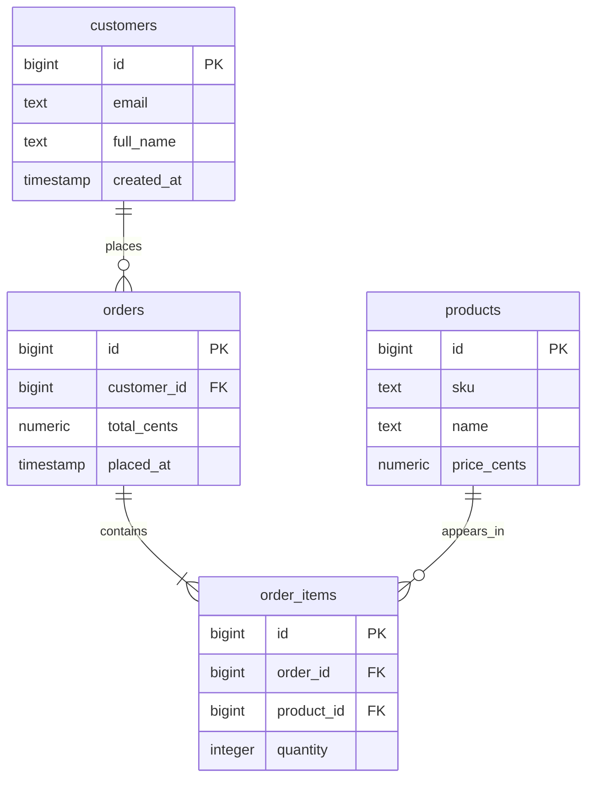

# sql-x-ray

**See the structure, not the data.**

`sql-x-ray` produces a privacy-safe structural dump of a SQL database, designed as priming context for an LLM. Structure only, never values: no defaults, no constraint expressions, no view bodies, no enum labels, no sample data. Safe to share with any LLM regardless of what your database contains.

***

## Why this exists

Copying a full schema into an LLM chat fails on size for any non-trivial database, and even when it fits, view bodies and CHECK expressions can leak business logic or literal values. Sample queries are slow and error-prone. `sql-x-ray` gives the LLM exactly what it needs to write accurate queries against your schema (tables, columns, types, relationships, indexes) and nothing it shouldn't have.

***

## Try it in your browser

The fastest way to see the output is to run it against a preloaded sample database at [sqlize.online](https://sqlize.online). No install, no signup, no setup.

1. Open [sqlize.online](https://sqlize.online)
2. Pick a ReadOnly sample database from the engine dropdown
3. Paste the matching script from this repo (e.g. `scripts/postgres-xray.sql`)
4. Click **Run SQL code**
5. The single result cell contains the full dump (JSON for most engines, Markdown for Firebird). Copy it, paste into your LLM of choice, done.

Sample databases available on [sqlize.online](https://sqlize.online):

| Engine | Sample schema |
|---|---|
| PostgreSQL 18 [Bookings](https://postgrespro.com/community/demodb) (ReadOnly) | Airline reservations: flights, bookings, tickets, boarding passes, seats |
| PostgreSQL 17 + PostGIS [WorkShop](https://postgis.net/workshops/postgis-intro/) (ReadOnly) | Spatial and geographic data |
| MySQL 9.7 [Sakila](https://dev.mysql.com/doc/sakila/en/) (ReadOnly) | DVD rental store (the canonical sample) |
| MariaDB 11.8 [OpenFlights](https://openflights.org/data.html) (ReadOnly) | Airport, airline, and route data |
| MS SQL Server 2022 [AdventureWorks](https://learn.microsoft.com/en-us/sql/samples/adventureworks-install-configure) (ReadOnly) | Microsoft's bicycle company (68 tables, 5 schemas) |
| Oracle Database 19c [HR](https://docs.oracle.com/en/database/oracle/oracle-database/19/comsc/installing-sample-schemas.html) | Classic Oracle HR sample (employees, departments, jobs) |
| Firebird 4.0 [Employee](https://firebirdsql.org/manual/qsg2-installing.html) | Firebird's bundled sample |
| SQLite 3 Preloaded | Custom lab and survey database with Palmer Penguins data (13 tables across staff, experiments, equipment, and penguins) |

This is also the right way to validate a script after editing it. Test against a known schema before pointing it at your real database.

Other SQL playgrounds worth knowing:

- [DB Fiddle](https://www.db-fiddle.com): PostgreSQL, MySQL, SQLite, SQL Server. Clean two-pane interface.
- [Aiven Postgres Playground](https://aiven.io/tools/pg-playground): PostgreSQL via WebAssembly, entirely in your browser.
- [playcode.io SQL Playground](https://playcode.io/sql-playground): PostgreSQL via PGlite with preloaded Chinook (music store) and Northwind (e-commerce).

***

## What the output looks like

A trimmed example dump of a tiny e-commerce schema:

```json
{
  "metadata": {
    "tool_name": "sql-x-ray",
    "engine": "postgresql",
    "engine_version": "16.4",
    "database": "shop",
    "generated_at": "2026-05-14T14:30:00Z",
    "schema_filter": "%",
    "schemas": ["public"],
    "privacy_note": "This document contains only structural metadata..."
  },
  "tables": [
    {
      "schema": "public",
      "name": "orders",
      "kind": "table",
      "row_count_estimate": 142893,
      "total_size_bytes": 24576000,
      "primary_key": { "columns": ["order_id"] },
      "foreign_keys": [
        {
          "from_columns": ["customer_id"],
          "to_schema": "public",
          "to_table": "customers",
          "to_columns": ["customer_id"],
          "on_update": "NO ACTION",
          "on_delete": "RESTRICT"
        }
      ],
      "check_constraint_count": 2,
      "indexes": [
        {
          "name": "orders_customer_id_idx",
          "method": "btree",
          "unique": false,
          "partial": false,
          "columns": ["customer_id"]
        },
        {
          "name": "orders_status_created_idx",
          "method": "btree",
          "unique": false,
          "partial": true,
          "columns": ["status", "created_at"]
        }
      ],
      "trigger_count": 1,
      "columns": [
        { "name": "order_id",    "position": 1, "data_type": "bigint",                   "nullable": false, "is_identity": true,  "is_generated": false, "has_default": false },
        { "name": "customer_id", "position": 2, "data_type": "bigint",                   "nullable": false, "is_identity": false, "is_generated": false, "has_default": false },
        { "name": "status",      "position": 3, "data_type": "text",                     "nullable": false, "is_identity": false, "is_generated": false, "has_default": true  },
        { "name": "total_cents", "position": 4, "data_type": "integer",                  "nullable": false, "is_identity": false, "is_generated": false, "has_default": false },
        { "name": "created_at",  "position": 5, "data_type": "timestamp with time zone", "nullable": false, "is_identity": false, "is_generated": false, "has_default": true  }
      ]
    }
  ],
  "views": [],
  "routines": [],
  "sequences": [{ "schema": "public", "name": "orders_order_id_seq", "data_type": "bigint" }],
  "types": []
}
```

An LLM can use this to write a correct join between `orders` and `customers` (right FK direction, right types, right nullability) without ever seeing a single customer record.

***

## Run it on your own database

1. Open the script for your engine in the `scripts/` folder
2. Adjust the `params` block at the top of the file (schema filter, whether to include row counts, whether to pretty-print)
3. Run the script in any SQL client (DBeaver, DataGrip, psql, pgAdmin, Metabase, Insight, SSMS, Snowsight)
4. The result is a single cell containing a JSON document. Copy and save it as `schema.json`.

To feed the dump to an LLM, paste it into a chat with a short intro:

> Here is the structural metadata for a SQL database I work with. It contains only structure, no values, no row data, no view bodies. I'll be asking you to help me write queries against this schema.
>
> ```json
> { ...paste the dump... }
> ```

***

## What's in the dump

For every table:

- Schema, name, kind (table, partitioned table, foreign table)
- Estimated row count and on-disk size
- All columns with name, position, data type, nullability, identity and generated-column flags, and whether a default exists
- Primary key columns
- Foreign keys with from-columns, target schema/table/columns, and ON UPDATE / ON DELETE actions
- Unique constraints with their column lists
- Check constraint count (existence only)
- All secondary indexes (excludes indexes backing PK and unique constraints to avoid duplication) with name, method, uniqueness, partial-index flag, columns (including expression placeholders), and INCLUDE columns
- Trigger count (existence only)
- Inheritance and partition parents

For views and materialized views: schema, name, and column list with types and nullability.

For routines: schema, name, kind (function, procedure, aggregate, window), language, return type, argument signature, and an `is_trigger` flag. Bodies are never extracted. Extension-owned functions are filtered out so output stays clean.

For sequences and user-defined types: existence and basic metadata only. Enum value labels are excluded by design.

***

## What you can build from the dump

The dump is structural metadata in a predictable JSON shape. Once you have it, plenty of useful artifacts fall out almost for free, mostly by handing the JSON to an LLM with a short instruction.

### Visual diagrams

**Mermaid ER diagrams** for documentation, READMEs, or wikis. GitHub, GitLab, Notion, Obsidian, and most static-site generators render Mermaid natively. Prompt:

> Convert this schema dump into a Mermaid `erDiagram`. Show primary keys with `PK`, foreign keys with `FK`, and connect tables using FK relationships with proper cardinality.

A small e-commerce schema renders as:



**DBML for [dbdiagram.io](https://dbdiagram.io)** if you want a more polished, browsable diagram. Same approach, different output syntax.

**PlantUML**, **Graphviz/DOT**, **D2** all work too — any text-based diagram language an LLM knows.

### Code generation

| Target | What to ask for |
|---|---|
| Python ORMs | SQLAlchemy 2.0 `Mapped[]` models, Django models, Tortoise ORM, peewee |
| TypeScript / JS | Prisma schemas, TypeORM entities, Drizzle ORM schemas, Zod validators |
| Go | GORM structs, sqlc queries with `CREATE TABLE` references |
| Type definitions | Pydantic v2 models, TypeScript interfaces, JSON Schema, protobuf, GraphQL SDL |
| API specs | OpenAPI/Swagger, GraphQL schemas with resolvers stubbed |
| Migration tools | Alembic, Flyway, Liquibase, dbmate skeletons |

Generic prompt: "Generate SQLAlchemy 2.0 declarative models from this schema dump. Use `Mapped[]` annotations, match column types properly, and add `relationship()` calls based on the foreign keys."

### Documentation

- **Data dictionary** in Markdown, one table per section, columns with types and FK references
- **Onboarding doc** describing what each table is for, inferred from column names and relationships
- **High-level domain map** grouping tables into clusters (auth, billing, content, audit, etc.)

### Schema analysis

- **Orphan tables** with no foreign keys in or out, often dead tables or audit logs worth flagging
- **Hub tables** with many incoming foreign keys, central entities like `users` or `orders` worth understanding first
- **Naming convention audits** for column suffixes (`_id`, `_at`, `_count`), casing (snake vs camel), plural vs singular table names
- **Schema diff** by running the script before and after a migration and comparing the two JSON outputs
- **Missing PK audit** showing tables with no primary key declared
- **FK without index** showing relationships likely to cause slow joins (where the engine reports indexes)

A diff prompt: "Here are two schema dumps of the same database taken a month apart. Summarize what changed: new tables, dropped columns, type changes, added or removed foreign keys."

### Query writing (the original use case)

Paste the dump into your LLM chat once at the start of a session, then ask:

> Give me a query that returns customers who placed an order in the last 30 days but never returned anything.

The LLM has the tables, the columns, the types, and the relationships in one place. Joins come out right on the first try, and the LLM never invents columns that don't exist.

### Test data and migration helpers

- **Seed scripts** that populate tables in dependency order based on the FK graph
- **Test fixture generators** that produce plausible synthetic rows for each table
- **Migration script scaffolding** ("here's how to add a column" prompts work well with the full schema as context)

***

## What's never in the dump

| Excluded | Why |
|---|---|
| Default value literals | Could contain personal data or business strings |
| Check constraint expressions | Could contain literal values or domain logic |
| View and materialized view definitions | SQL bodies could reveal filtering over sensitive columns |
| Function and procedure bodies | Could contain hardcoded identifiers or business logic |
| Enum value labels | Could be clinical, financial, legal, or otherwise sensitive |
| Comments and descriptions | Free-text fields, could contain anything |
| Row data and column samples | Never queried at all |

Existence is still recorded where useful. `check_constraint_count: 3` tells the LLM there are check constraints on this table without revealing what they enforce. Expression indexes show `<expression>` in their column list as a placeholder.

***

## Engine support

| Engine | Script | Status | Minimum version |
|---|---|---|---|
| [PostgreSQL](https://dbdb.io/db/postgresql) | `scripts/postgres-xray.sql` | Stable | PostgreSQL 12 |
| [MySQL](https://dbdb.io/db/mysql) | `scripts/mysql-xray.sql` | Stable | MySQL 8.0.16 |
| [MariaDB](https://dbdb.io/db/mariadb) | `scripts/mariadb-xray.sql` | Stable | MariaDB 10.5 |
| [SQL Server](https://dbdb.io/db/sql-server) | `scripts/sqlserver-xray.sql` | Stable | SQL Server 2022 |
| [Firebird](https://dbdb.io/db/firebird) | `scripts/firebird-xray.sql` | Stable (Markdown output) | Firebird 4.0 |
| [Oracle](https://dbdb.io/db/oracle) | `scripts/oracle-xray.sql` | Stable | Oracle 18c |
| [SQLite](https://dbdb.io/db/sqlite) | `scripts/sqlite-xray.sql` | Stable | SQLite 3.44 |
| [BigQuery](https://dbdb.io/db/bigquery) | `scripts/bigquery-xray.sql` | Draft (pending validation) | GoogleSQL |
| [Snowflake](https://dbdb.io/db/snowflake) | `scripts/snowflake-xray.sql` | Planned | |

Engine names link to their entry in [Database of Databases](https://dbdb.io), the database encyclopedia maintained by Carnegie Mellon University.

### Why Firebird outputs Markdown instead of JSON

Firebird 4.0 has no native JSON functions. `JSON_OBJECT`, `JSON_ARRAYAGG`, and `JSON_QUERY` are still in proposal stage for future releases (likely 6.0+). Building JSON in Firebird 4.0 would mean fully manual string concatenation with explicit quote escaping for every key and value, plus carefully tracking opening and closing braces by hand. That path is doable but verbose and error-prone, and `LIST()` does not support `ORDER BY` so every aggregation needs a derived-table wrapper just to get rows in a stable order.

Markdown construction needs the same aggregation tricks but skips the structural punctuation and escaping rules, which makes the script considerably less fragile. The output is still single-column text and still LLM-friendly. The trade-off is that Firebird dumps are not programmatically parseable the way the JSON dumps are, so any tooling that consumes sql-x-ray output needs to handle the format difference for this one engine.

If you specifically need JSON from Firebird, the natural path is to wait for native JSON support in a future release rather than build a fragile string-concatenation version now.

### MySQL and MariaDB on hosted sandboxes

A note on the MySQL and MariaDB scripts: a small number of hosted SQL sandbox environments (including [sqlize.online](https://sqlize.online)) ship an `information_schema` with mixed `utf8mb3` collations and a query optimizer that drops explicit collation conversions during CTE materialization. On those environments some cross-CTE joins (most visibly `routines` and `trigger_count`) can come back empty even though the script handles the collation mismatch correctly. Standard MySQL 8+/9+ and MariaDB 10.5+ installations use `utf8mb4` throughout `information_schema` and are not affected.

***

## Script conventions

All seven scripts share a consistent structure so they read alike. If you can navigate one, you can navigate the rest.

### File layout

Every script has the same top-level shape:

1. **Header block** between `-- ===` bars, containing:
   - Title: `sql-x-ray for <Engine> <minimum-version>+`
   - One- or two-sentence description
   - `Repository:` and `License:` lines
   - `Target:` — engine version compatibility notes
   - `Catalog source:` — which system catalog is used and why
   - `Usage:` — numbered steps to run the script
   - `What's captured:` — output sections with brief descriptions
   - `What's deliberately excluded for privacy:` — bulleted list
   - `<Engine>-specific notes:` — quirks specific to this engine
2. **A single `WITH ... SELECT` query** comprising the body (Firebird uses the same shape, but its terminal `SELECT` assembles Markdown rather than JSON).
3. **Section markers between CTEs.** Each logical group of CTEs is preceded by a three-line comment block:
   ```sql
   -- ====================================================================
   -- SECTION NAME
   -- ====================================================================
   ```

### Canonical section names

Most scripts share the same ordered set of sections, omitting any that don't apply to the engine:

| Section | Purpose |
|---|---|
| `COLUMNS` | column metadata per table |
| `PRIMARY KEYS` | primary key columns per table |
| `FOREIGN KEYS` | foreign key relationships per table |
| `UNIQUE CONSTRAINTS` | unique constraints per table |
| `CHECK CONSTRAINT COUNTS` | count of CHECK constraints (expressions excluded) |
| `INDEXES` | user-defined indexes, excluding PK-backing and unique-backing |
| `TRIGGER COUNTS` | count of triggers per table |
| `TABLE METADATA` | per-table flags (partitioned, row count estimate, size estimate) |
| `TABLES` | final assembly of the tables array |
| `VIEWS` | views and their column lists |
| `ROUTINES` | functions and stored procedures (signatures only) |
| `SEQUENCES` | sequence objects (name only) |
| `PACKAGES` | package objects (name only, where supported) |
| `METADATA` | the dump's metadata header (tool name, engine, timestamp) |
| `FINAL ASSEMBLY` | the outermost `SELECT` that emits `schema_dump` |

Engine-specific sections keep their own descriptive names. PostgreSQL has `INHERITANCE / PARTITION PARENTS` and `USER-DEFINED TYPES`. MySQL, MariaDB, and SQL Server have `PARTITIONED TABLES` as a separate flag. Firebird has `TYPE RENDERING` and `USER RELATIONS` (Firebird-specific lookup CTEs) plus several Markdown assembly sections in place of the JSON `TABLES` / `VIEWS` blocks.

### Code style

| Aspect | Convention |
|---|---|
| SQL keywords | UPPERCASE (`SELECT`, `FROM`, `JOIN`, `GROUP BY`) |
| Identifiers | lowercase, except where the catalog itself dictates otherwise (`RDB$RELATIONS` in Firebird, `USER_TAB_COLS` in Oracle, `INFORMATION_SCHEMA.TABLES` in standard SQL) |
| Indentation | 4 spaces, no tabs |
| Commas | trailing |
| Line endings | LF |
| Trailing whitespace | none |
| Line length | soft target around 80 columns |

### Comment style

- Header block sections end with `:` (e.g. `Catalog source:`, `Usage:`).
- Body section markers use ALL-CAPS titles inside `-- ===` bars.
- Parenthetical clarifications are lowercase and added only when they convey non-obvious information. Example: `INDEXES (excludes PK-backing and unique-backing indexes)` is non-obvious; `COLUMNS (column metadata)` would just restate the title and is omitted.
- Inline comments inside CTEs are mixed-case prose. They explain *why* (engine quirks, catalog gotchas, version constraints), not *what* (the SQL itself should be readable on its own).

***

## Requirements

- A SQL client that can run a multi-CTE query and return a single text cell (JSON for most engines, Markdown for Firebird)
- Read permission on the database's system catalogs and `information_schema`
- No installs, no extensions, no Python required

***

## Security and privacy

- **Read-only.** Every script queries system catalogs and `information_schema` only. It never modifies the database, never queries row data, and never samples values from user columns.
- **Structure only, never values.** No field in the output can carry sensitive data by design. The guarantee comes from what the script doesn't read, not from filtering applied afterward.
- **No network calls.** Everything runs in your SQL client against your database. Nothing leaves your environment until you choose to share the output.

### Edge cases worth knowing

The privacy stance is strong but not infinite. The following can appear in a dump and may matter in some contexts:

- **Names of schemas, tables, columns, indexes, and constraints.** Almost always describe types of data rather than data itself, but proprietary product names or classified project codenames could be considered sensitive. Review before sharing externally if this applies to you.
- **Estimated row counts.** Aggregate counts are universally safe under HIPAA, GDPR, and similar regimes, but in very small populations a count could narrow identification. Set `include_stats = FALSE` if needed.
- **Foreign key target names.** Reveal which tables relate to which.

***

## Using the dump with an LLM

The output is designed to be safe for external LLMs. That guarantee covers what the tool produces. It does not cover the service you send it to.

Strong recommendation: use only an LLM your employer has explicitly vetted, or one with a contractual relationship (enterprise API agreement, signed BAA, private deployment, or documented institutional policy that permits the use). Even structural metadata describes systems that may contain protected data, and many organizations have policies on disclosing system descriptions to external services.

Before pasting a dump into any LLM:

- Check your organization's data governance, IT, or security policy
- Confirm the LLM provider's data handling terms (training opt-out, retention, geographic location, subprocessor list)
- Prefer enterprise or API tiers with zero-retention guarantees over free consumer chat tiers
- When in doubt, ask your DPO, CISO, IT, or compliance contact

The author and contributors of `sql-x-ray` accept no liability for misuse, data exposure, regulatory consequences, or contractual breaches that result from sharing dump output with third-party services. The tool's privacy properties are a starting point, not a substitute for institutional review.

***

## License

This project is licensed under [CC BY-NC-SA 4.0](https://creativecommons.org/licenses/by-nc-sa/4.0/).

You are free to:

- Use, share, and adapt this work
- Use it at your job

Under these terms:

- **Attribution.** Credit the original author.
- **NonCommercial.** No selling or commercial products.
- **ShareAlike.** Derivatives must use the same license.